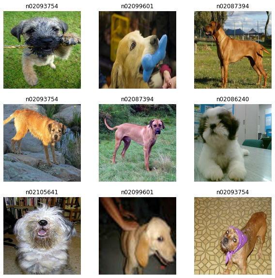
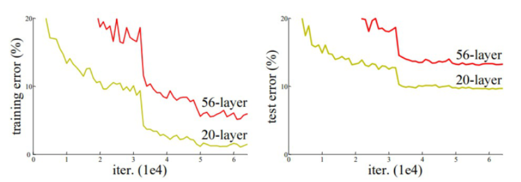

# ResNet50 Transfer Learning Exercise

In this repository, I'll be doing a transfer learning exercise with ResNet 50 model to train on the Imagewoof dataset using Tensorflow.

Source of Data: [ImageWoof-320px](	https://s3.amazonaws.com/fast-ai-imageclas/imagewoof-320.tgz)

# Table of contents
1. [ResNetIntro](#ResNetIntro)
    1. [USA Dataset](#USA_dataset)
    2. [Test with Colab Notebook](#ColabNotebook)

## ResNetIntro 

Just a quick background on Residual Neural Networks (ResNets), these are Deep Neural Networks there were introduced in 2015 by Kaiming He, Xiangyu Zhang, Shaoqing Ren and Jian Sun in their paper “Deep Residual Learning for Image Recognition” [Deep Residual Learning for Image Recognition](https://www.cv-foundation.org/openaccess/content_cvpr_2016/papers/He_Deep_Residual_Learning_CVPR_2016_paper.pdf). 

The field of computer vision saw multiple breakthrough as researchers trended towards making deeper and deeper neural netwroks such as AlexNet [ImageNet Classification with Deep Convolutional Neural Networks](https://papers.nips.cc/paper/2012/file/c399862d3b9d6b76c8436e924a68c45b-Paper.pdf) and others, per the following blog post [Introduction to Resnet or Residual Network](https://www.mygreatlearning.com/blog/resnet/) this came with an overhead in difficulty training these deep models with accuracy starting to saturate and degrade.

An example of the aformentioned is from the graph below:

As quoted "Training error (left) and test error (right) on CIFAR-10with 20-layer and 56-layer “plain” networks. The deeper networkhas higher training error, and thus test error."

## ImageWoof Dataset

Per the following link [Papers With Code Image Woof](https://paperswithcode.com/dataset/imagewoof), Imagewoff is a subset of 10 dog breed classes from Imagenet. The breeds are: Australian terrier, Border terrier, Samoyed, Beagle, Shih-Tzu, English foxhound, Rhodesian ridgeback, Dingo, Golden retriever, Old English sheepdog. Therefore we will be expecting to create a 10 class classification problem with 10 neurons in the output layer.

## Naming the classes to be human readable

In the dataset we have the 10 classes, however they are all code names that are not necessarily interpretable therefore will create a separate directory that has them with correct labels.

* 'Australian terrier' - n02093754
* 'Beagle' - n02088364
* 'Border terrier' - n02096294
* 'Dingo' - n02115641
* 'English foxhound' - n02089973
* 'Golden retriever'- n02099601
* 'Old English sheepdog' - n02105641  
* 'Rhodesian ridgeback' - n02087394 
* 'Shih-Tzu' - n02086240 
* 'Samoyed' - n02111889 

<!--
see how to make table of contents in markdown: https://stackoverflow.com/questions/11948245/markdown-to-create-pages-and-table-of-contents

2. [Some paragraph](#paragraph1)
    1. [Sub paragraph](#subparagraph1)
3. [Another paragraph](#paragraph2)
-->

<!--
## Some paragraph 
The first paragraph text

### Sub paragraph 
This is a sub paragraph, formatted in heading 3 style

## Another paragraph 
The second paragraph text
-->

